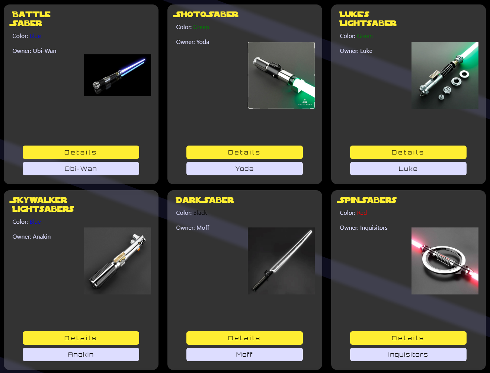

# [Jedi Blades](https://jedi-blades-786cf143833b.herokuapp.com/)

Welcome to Jedi Blades! Our website shows our wide selection of lightsabers. Whether you are a Jedi or a Sith, we have the perfect lightsaber for you.  

Our lightsabers are made from the finest materials and are built to last. They are perfect for dueling or for display. We also have lightsaber accessories such as stands and cases to help you take care of your lightsaber.
So come on in and take a look at our selection. May the Force be with you!

  

## UX

### User Goals

Whether you are a Jedi or a Sith, you can find the perfect lightsaber for your purpose and budget.

- See all the available lightsabers
- View details of each lightsaber so that you can find the right one for you
- See all the legendary characters who have used each type of lightsaber

#### User Stories

All user stories are mapped to Issues in Github, with acceptance criteria and tasks. We tracked the issues with a Github Project [progress board](https://github.com/users/EmilionR/projects/6) and grouped them into Epics so that we could follow Agile methodology.  

**EPIC - UI & Navigation**

- Dark side toggle: As a site user I can join the dark side so that I can be a sith lord
- Accessible UI/UX: As a user with disabilities I can use the site in a way that works for me so that I can enjoy the site without struggle
- Improved Ease of Use: As a site user I can interact with the page intuitively so that I have a nice experience with the site
- Responsive design: As a site user I can view the page in a format appropriate for my screen so that I can use the site as intended on any device
- Site Navigation: As a site user I can easily navigate the site so that I can find any page or section without issues
- Content Policy: As a user I can trust jedi-blades so that I can understand the the rights of their imagery and intentions

**EPIC - Lightsabers**

- Lightsaber Details: As a site user I can view a dedicated page for a specific lightsaber so that I can learn more about it
- List of Lightsabers: As a site user I can see a list of all lightsabers so that I can browse and find the one I want to see

**EPIC - Characters**

- Character List: As a site user I can view a list of characters so that I can browse and find any character
- Character Details Page: As a site user I can view a character's details page so that I can learn more about the character
- Scrolling Text Hero Star Wars Style: As a site user I can see from the hero text what the site is about so that I understand the content of the website

**EPIC - Team Page**

- Team page: As a site user I can view a page about the team so that I can learn about the developers behind the project
- Team members: As a site user I can see the team members so that I can learn more about the team

### Structure

#### Entity relationship diagram

<!-- These are the models that we used to build the site, and how they relate -->

### Features

#### Landing page

The landing page includes:

- A header with navigation links and a footer with social, team, and legal links.
- A button so the user can choose to play Star Wars music while picking their favorite lightsaber.
- A scrolling intro section in the style of the Star Wars intro text, so the user can read all about Jedi Blades.
- A "Choose your path" button to filter the available lightsabers by light and/or dark side
- The selection of lightsabers. Each lightsaber card shows an image, the name, color, and owner of the lightsaber, and buttons to see a detail about that saber or character.
- The cursor, in the shape of a lightsaber.

#### Lightsaber details

Each lightsaber's details include an image of the saber, its name, which character wields it, and its design and lore so that users can pick their perfect weapon.

#### Character details

Each character's details include an image, the character's name, light/dark side alignment, home planet, and lore.

#### Team page

The team page shows the talented Sabersmiths who forged the Jedi Blades project.

### Surface

#### Wireframes

We started out with these wireframes:

  
  
  

We developed this wireframe to help build the Lightsaber and Character list pages, and the Team page:

  

Then we had more ideas for scrolling text and a Light Side/Dark Side options:

  

The Team page:

  

And the About page:

  

#### Color Palette

The official Star Wars yellow and black provided inspiration:

  

The palette we developed has some subtler colors for visual depth, and high contrast for accessibility. It was created with [Coolors](https://coolors.co/).

  

We used official colors for the lightsabers that are specific to each character:

- Blue: #2e67f8
- Green: #2ff924
- Red: #c13d3d
- Purple: #7851a9
- Yellow: #f9ff58
- White: #ddddff

#### Typography

We used Google Fonts for this project. The titles are Orbitron, which is a Google Fonts option similar to the Star Wars logo font:

  

The main font is Raleway, which is clear and easy to read, for accessibility:

  

#### Surface updates during development

During development, we refined the visual design, using images and colors to create mood and depth.

### Screenshots

<!-- Screenshots of the project -->

The lightsaber cards on the landing page:

  

Lightsaber details:

  

Character details:

  

The Team page:

  

## Testing

### Lighthouse reports

Desktop landing page:

  

Desktop team page:

  

Mobile landing page:

  

Mobile team page:

  

## Future Implementations

<!-- These are all the awesome things that the page will have in the future -->

## Tools & Technologies Used

-  used for version control. (`git add`, `git commit`, `git push`)
-  used for secure online code storage.
-  used as a cloud-based IDE for development.
-  used for the main site content.
-  used for the main site design and layout.
-  used for user interaction on the site.
-  used as the back-end programming language.
-  used for hosting the deployed back-end site.
-  used as the Python framework for the site.
-  used as the relational database management.
-  used for serving static files with Heroku.
-  used for online static file storage.
-  used for creating wireframes.
-  used for creating wireframes.
-  used as the front-end CSS framework for modern responsiveness and pre-built components.
-  used for the icons.
-  used to help debug, troubleshoot, and explain things.

## Credits

<!-- These are the lovely people and resources that we used to put this project together! -->

Thanks to the whole team!
